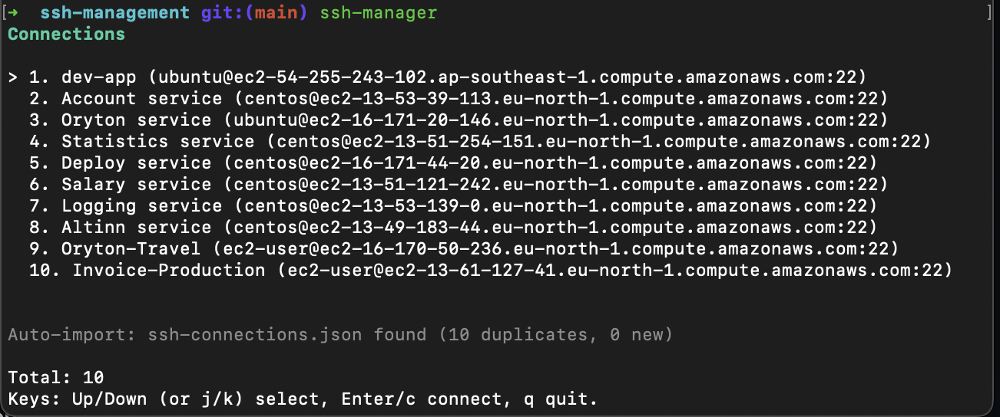

# SSH Manager



Encrypted SSH connection manager with:
- TUI unlock + connection list + direct connect
- CLI subcommands for scripting
- AES-256-GCM encrypted local config with backup rotation

## Requirements

- Go 1.22+ (you are using 1.26)
- `ssh` available in your terminal

## Build

```bash
cd ~/ssh-manager
go build -o ssh-manager .
```

## Install As Global Command

This repo uses custom make files under `make/`.

Install (global command):

```bash
cd ~/ssh-manager
make -f make/install install
```

Upgrade (after pulling new code):

```bash
cd ~/ssh-manager
make -f make/install upgrade
```

Uninstall:

```bash
cd ~/ssh-manager
make -f make/uninstall uninstall
```

Or from anywhere:

```bash
ssh-manager uninstall
ssh-manager uninstall --force
```

What install does:
- Builds `ssh-manager` into `~/.local/bin/ssh-manager`
- Injects app version from `VERSION` file into `ssh-manager -v`
- Adds `~/.local/bin` to `~/.zshrc` if missing

What uninstall does:
- Removes `~/.local/bin/ssh-manager`
- Deletes local encrypted config data (`config.enc` and backups)

Make sure `~/.local/bin` is in your `PATH`.

## Run

TUI mode (default):

```bash
ssh-manager
```

or from source:

```bash
cd ~/ssh-manager
go run .
```

Check version:

```bash
ssh-manager -v
ssh-manager --version
```

## UX Flow (Current)

1. Enter master password once.
2. See connection list immediately.
3. Use `Up/Down` (or `j/k`) to choose item.
4. Press `Enter` or `c` to connect.
5. No second password prompt in that active session.

## Auto Import JSON

On unlock, app checks for `ssh-connections.json` in the current working directory:
- If found: auto-imports and merges non-duplicates.
- If not found: continues normally.

Tip:

```bash
cd /path/that/contains/ssh-connections.json
ssh-manager
```

## CLI Commands

```bash
ssh-manager list
ssh-manager list --json
ssh-manager add --name prod --host 203.0.113.10 --port 22 --user ubuntu --key ~/.ssh/id_ed25519
ssh-manager connect prod
ssh-manager delete prod
ssh-manager export -o ./ssh-connections.json
ssh-manager import ./ssh-connections.json
ssh-manager import-ssh-config ~/.ssh/config
ssh-manager export-ssh-config -o ./ssh_config_export
ssh-manager password
ssh-manager reset-all
ssh-manager reset-all --force
ssh-manager uninstall
ssh-manager uninstall --force
ssh-manager upgrade
ssh-manager upgrade --source /path/to/ssh-manager
```

For automation, you can pass password using env var:

```bash
SSH_MANAGER_PASSWORD='your-password' ssh-manager list
```

Password prompt behavior:
- CLI password prompts are hidden (not echoed).
- In TUI, password input is masked.

## Config Location

Config path is based on `os.UserConfigDir()`:
- macOS: `~/Library/Application Support/ssh-manager/config.enc`
- Linux: `~/.config/ssh-manager/config.enc`
- Windows: `%AppData%\\ssh-manager\\config.enc`

Backup files are rotated automatically:
- `config.enc` (current)
- `config.enc.1` (latest backup)
- `config.enc.2`
- `config.enc.3`

## Reset / Cleanup

Clear all connections (keep installed app + empty encrypted config):

```bash
ssh-manager reset-all
```

Delete config files manually:

```bash
rm -f "$HOME/Library/Application Support/ssh-manager/config.enc" \
      "$HOME/Library/Application Support/ssh-manager/config.enc.1" \
      "$HOME/Library/Application Support/ssh-manager/config.enc.2" \
      "$HOME/Library/Application Support/ssh-manager/config.enc.3"
```

Windows manual cleanup:

```powershell
Remove-Item "$env:APPDATA\ssh-manager\config.enc",
            "$env:APPDATA\ssh-manager\config.enc.1",
            "$env:APPDATA\ssh-manager\config.enc.2",
            "$env:APPDATA\ssh-manager\config.enc.3" -Force -ErrorAction SilentlyContinue
```

## Security Notes

- Data at rest is encrypted using scrypt + AES-256-GCM.
- Exported JSON / SSH config files are plaintext.
- Avoid sharing exported files directly.
- Environment variables can be visible to other processes/users depending on system setup.
